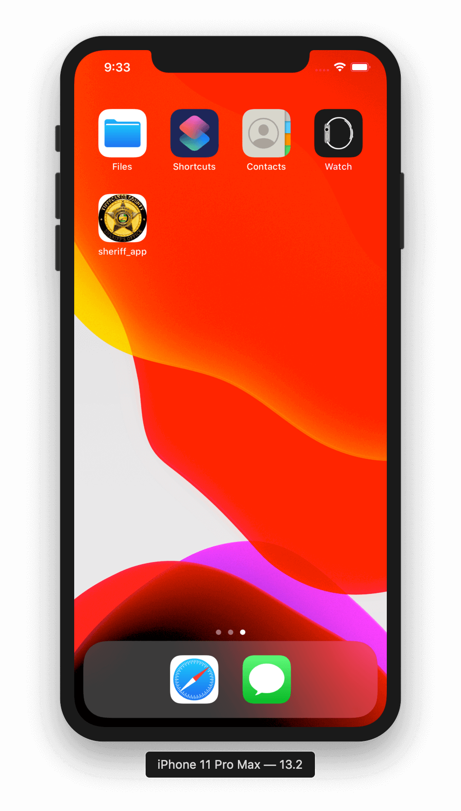
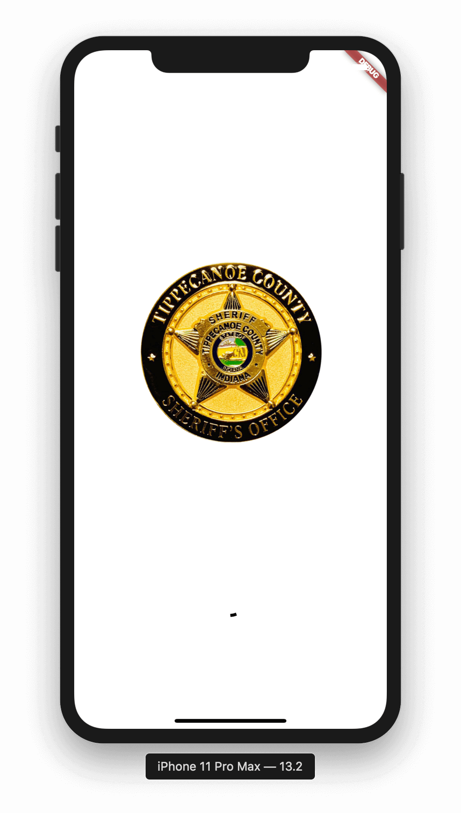
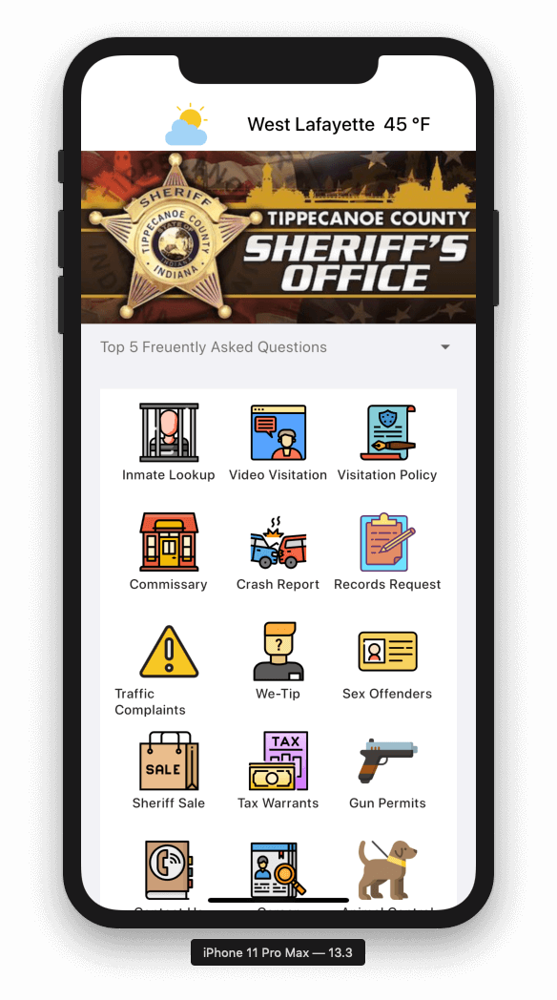
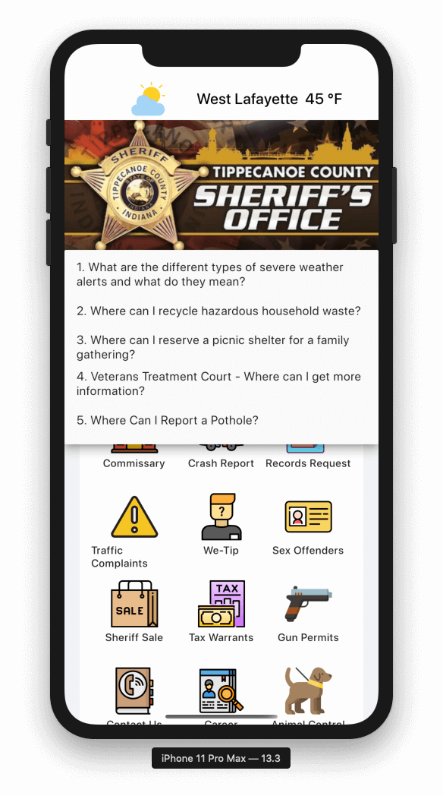
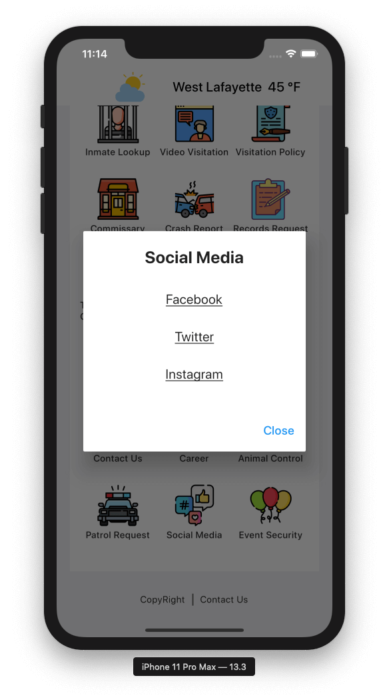
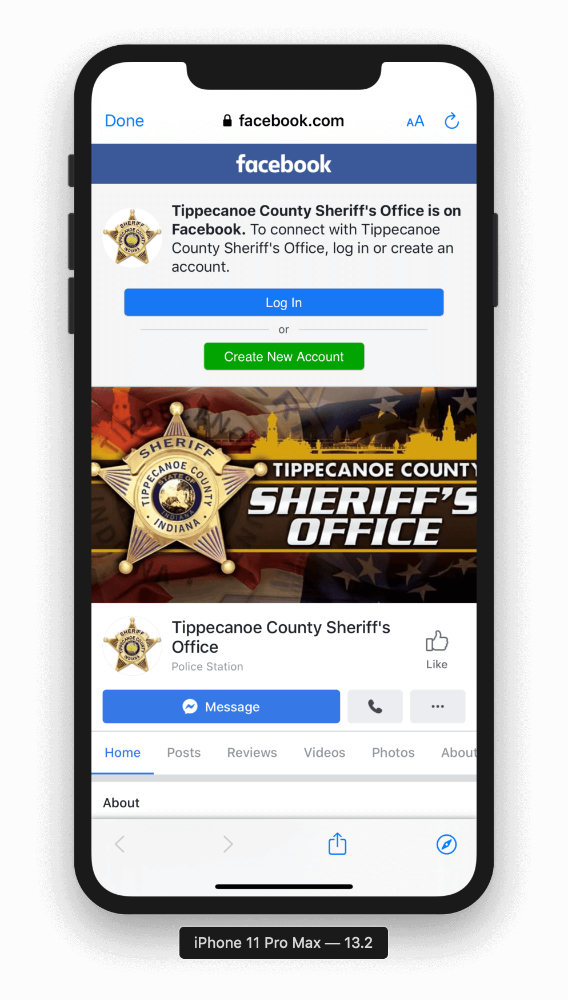
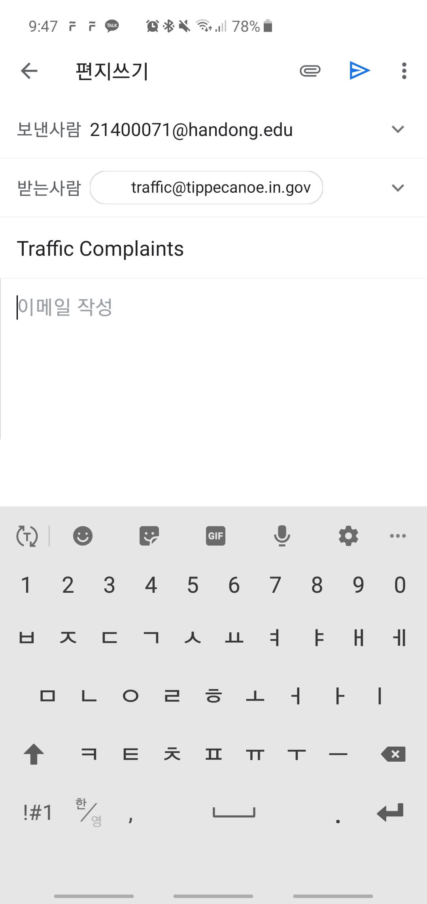

# Tippecanoe Sheriff's Office App clone

This app is a cloned app of `Tippecanoe Sheriff's Office` application developed with Flutter. The original app uploaded in playstore is developed with React Native.

(React Native로 개발된 `Tippecanoe Sheriff's Office` 을 Flutter로 클론한 프로젝트입니다.)

Original app can be found below(오리지널 앱은 밑에서 볼 수 있습니다)
[PlayStore](https://play.google.com/store/apps/details?id=com.tippsranger.tippecanoe_county_sheriff_app)

## Page Introduction

### Application logo and splash screen

### Main Page and Frequently Asked Questions

### Modal and Redirections

   

Icons used in this applications are downloaded from [FlatIcons](https://www.flaticon.com/). Authors of icons are credited in `copyrights` tab in the application

## License

Sheriff App is released under the MIT license.